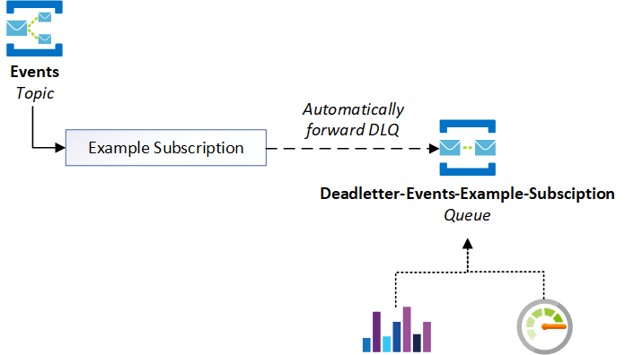
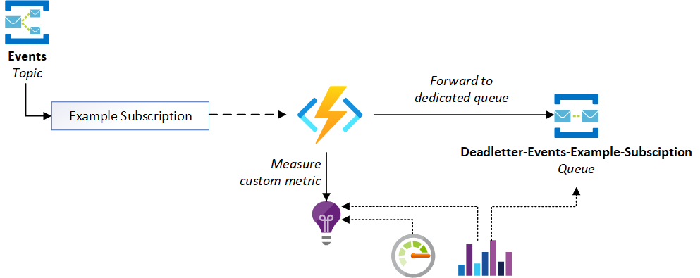

# Monitoring Azure Service Bus Topics

Examples for my [Monitoring Azure Service Bus Topics blog post](https://blog.tomkerkhove.be/2020/12/11/monitoring-azure-service-bus-topic-subscriptions/).

> ⚠ These examples are provided as-is and should not be used in production

## Automatically forward dead-letter messages to a dedicated queue

Automatically forward dead-letter messages to a dedicated queue using built-in Azure Service Bus functionality. Visualization & alerts can rely on Azure Service Bus metrics in Azure Monitor, ie Active Messages.

## Automatically enrich message information with Azure Functions

Automatically enrich message information with Azure Functions and emitting custom metrics to Azure Application Insights with multiple dimensions such as topic name, subscription name and message type.

After that, a copy of the message is forwarded to a dedicated queue for manual intervention in case there is a need.

Visualization & alerts can rely on Azure Service Bus metrics in Azure Monitor for the dedicated queue, ie Active Messages and/or our custom metric to have more fine-grained insights on what messages are being dead-lettered.

